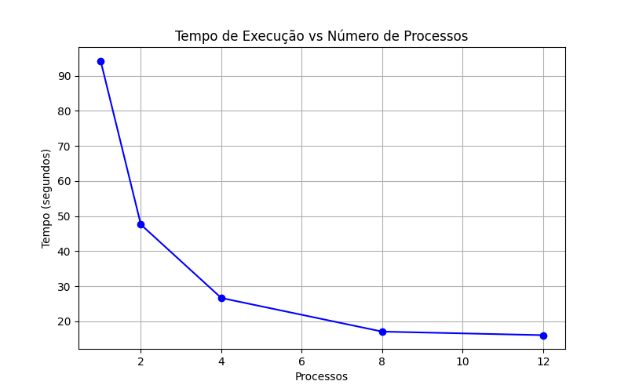
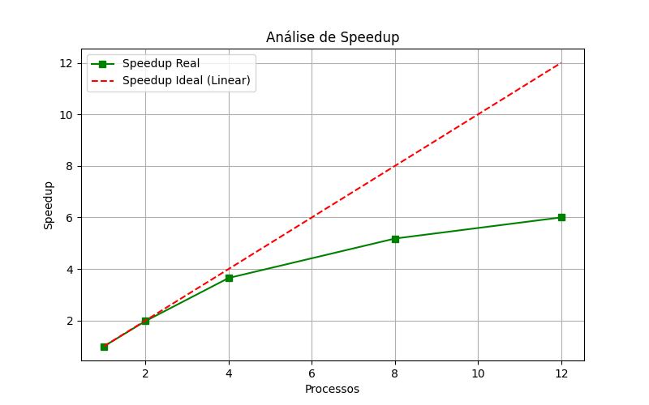
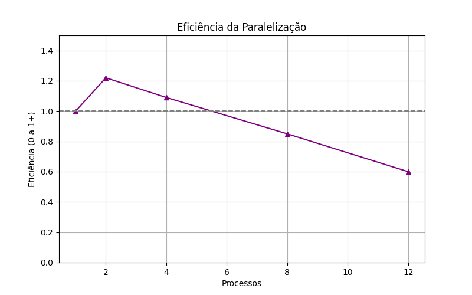

# Relatório da NOME DA ATIVIDADE

**Disciplina: Programação Concorrente e Distribuída** 
**Aluno(s): Filipe Ferreira Gonçalves**
**Turma: ADS 5 Semestre matutino**
**Professor: Rafael Marconi Ramos**
**Data: 20/03/2026**

---

# 1. Descrição do Problema

Descreva o problema computacional resolvido pelo programa.

## Orientações para preenchimento

Explique:

* Qual problema foi implementado
* Qual algoritmo foi utilizado
* Qual o tamanho da entrada utilizada nos testes
* Qual o objetivo da paralelização

**Questões que devem ser respondidas:**

* Qual é o objetivo do programa?
* Qual o volume de dados processado?
* Qual algoritmo foi utilizado?
* Qual a complexidade aproximada do algoritmo?

---

# 2. Ambiente Experimental

Descreva o ambiente em que os experimentos foram realizados.

## Orientações

Informar as características do hardware e software utilizados na execução dos testes.

| Item                        | Descrição |
| --------------------------- | --------- |
| Processador                 |     12th Gen Intel(R) Core(TM) i5-12500 (3.00 GHz)      |
| Número de núcleos           |     6 Núcleos      |
| Memória RAM                 |     16,0 GB (utilizável: 15,7 GB)      |
| Sistema Operacional         |     Windows 11 Pro      |
| Linguagem utilizada         |     Python 3.13.2      |
| Biblioteca de paralelização |     threading nativa do Python      |
| Compilador / Versão         |     CPython [MSC v.1942 64 bit (AMD64)] on win32      |

---

# 3. Metodologia de Testes

Explique como os experimentos foram conduzidos.

## Orientações

Descrever:

* Como o tempo de execução foi medido
* Quantas execuções foram realizadas
* Se foi utilizada média dos tempos
* Qual tamanho da entrada foi usado

### Configurações testadas

Os experimentos devem ser realizados nas seguintes configurações:

* 1 thread/processo (versão serial)
* 2 threads/processos
* 4 threads/processos
* 8 threads/processos
* 12 threads/processos

### Procedimento experimental

Descrever:

* Número de execuções para cada configuração
* Forma de cálculo da média
* Condições de execução (ex: máquina dedicada, carga do sistema, etc.)

---

# 4. Resultados Experimentais

Preencha a tabela com os **tempos médios de execução** obtidos.

## Orientações

* O tempo deve ser informado em **segundos**
* Utilizar a **média das execuções**

| Nº Threads/Processos | Tempo de Execução (s) |
| -------------------- | --------------------- |
| 1                    |                       |
| 2                    |                       |
| 4                    |                       |
| 8                    |                       |
| 12                   |                       |

---

# 5. Cálculo de Speedup e Eficiência

## Fórmulas Utilizadas

### Speedup

```
Speedup(p) = T(1) / T(p)
```

Onde:

* **T(1)** = tempo da execução serial
* **T(p)** = tempo com p threads/processos

### Eficiência

```
Eficiência(p) = Speedup(p) / p
```

Onde:

* **p** = número de threads ou processos

---

# 6. Tabela de Resultados

Preencha a tabela abaixo utilizando os tempos medidos.

| Threads/Processos | Tempo (s) | Speedup | Eficiência |
| ----------------- | --------- | ------- | ---------- |
| 1                 |           | 1.0     | 1.0        |
| 2                 |           |         |            |
| 4                 |           |         |            |
| 8                 |           |         |            |
| 12                |           |         |            |

---

# 7. Gráfico de Tempo de Execução

Construa um gráfico mostrando o **tempo de execução em função do número de threads/processos**.

## Orientações

* Eixo X: número de threads/processos
* Eixo Y: tempo de execução (segundos)

Inserir o gráfico abaixo:



---

# 8. Gráfico de Speedup

Construa um gráfico mostrando o **speedup obtido**.

## Orientações

* Eixo X: número de threads/processos
* Eixo Y: speedup
* Incluir também a **linha de speedup ideal (linear)** para comparação

Inserir o gráfico abaixo:



---

# 9. Gráfico de Eficiência

Construa um gráfico mostrando a **eficiência da paralelização**.

## Orientações

* Eixo X: número de threads/processos
* Eixo Y: eficiência
* Valores entre 0 e 1

Inserir o gráfico abaixo:



---

# 10. Análise dos Resultados

Realize uma análise crítica dos resultados obtidos.

## Questões a serem respondidas

* O speedup obtido foi próximo do ideal?
* A aplicação apresentou escalabilidade?
* Em qual ponto a eficiência começou a cair?
* O número de threads ultrapassa o número de núcleos físicos da máquina?
* Houve overhead de paralelização?

Discutir possíveis causas para:

* perda de desempenho
* gargalos no algoritmo
* sincronização entre threads/processos
* comunicação entre processos
* contenção de memória ou cache

---

# 11. Conclusão

Apresente as conclusões do experimento.

## Sugestões de pontos a comentar

* O paralelismo trouxe ganho significativo de desempenho?
* Qual foi o melhor número de threads/processos?
* O programa escala bem com o aumento do paralelismo?
* Quais melhorias poderiam ser feitas na implementação?

---
